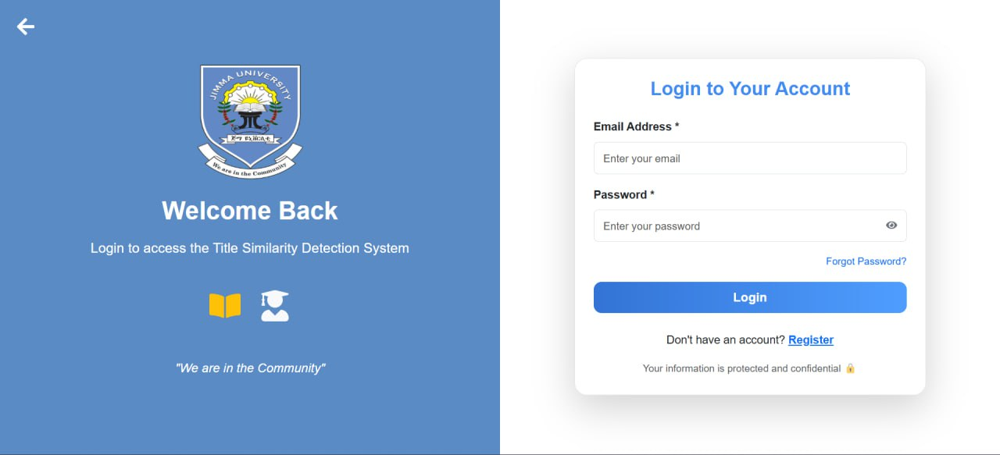
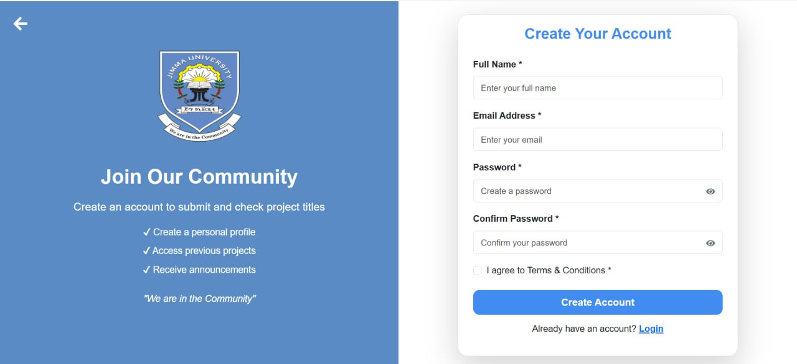
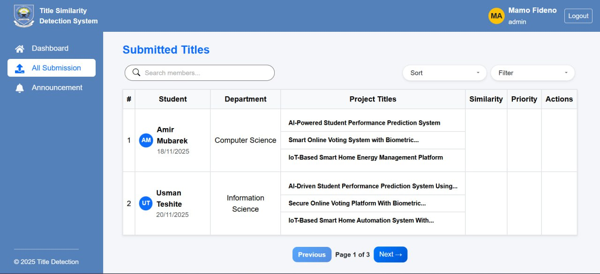
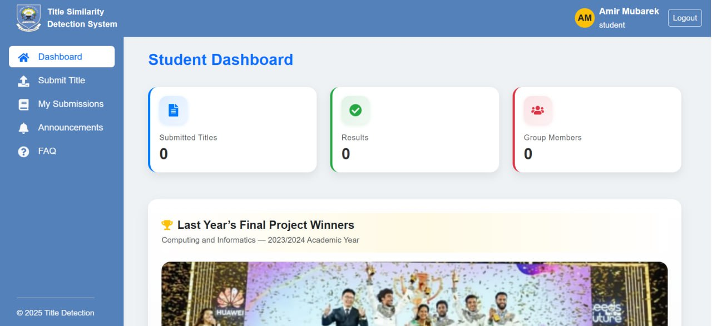
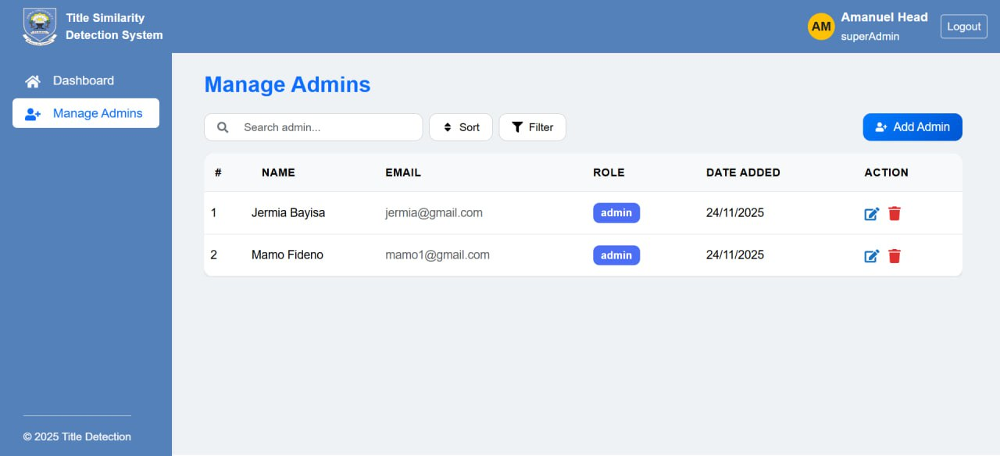

# 🎓 Smart Project Title Similarity Detection System

A smart web-based plagiarism and title similarity detection platform developed for Jimma University. The system helps students submit project titles, detect similarity with previously submitted projects, and reduce duplicated or repeated project ideas. The platform uses AI/NLP techniques to support originality and improve academic project management.

---

## ✨ Key Features

✅ User Authentication (Login/Register)  
✅ Student Dashboard  
✅ Admin Dashboard  
✅ Super Admin Management  
✅ Project Title Submission  
✅ AI-Based Similarity Detection  
✅ Search, Sort and Filter Functionality  
✅ Project Submission Tracking  
✅ Announcements System  
✅ User Role Management  
✅ Responsive and User-Friendly Interface  

---

## 📸 Project Screenshots

### 🔐 Login Page

---

### 📝 Registration Page

---

### 👨‍💼 Admin Dashboard

---

### 👨‍🎓 Student Dashboard

---

### ⚙️ Super Admin Dashboard

---

## 🧠 System Users

### 👨‍🎓 Student
- Register and login
- Submit project titles
- View similarity results
- Track previous submissions
- Receive announcements

### 👨‍🏫 Admin
- Review submitted titles
- Search and filter submissions
- Manage project approval process

### 👨‍💼 Super Admin
- Manage administrators
- Monitor the entire system
- Control system activities

---

## 🛠️ Technologies Used

### Frontend
- React.js
- HTML5
- CSS3
- JavaScript

### Backend
- Node.js
- Express.js

### Database
- MongoDB

### AI & Detection
- NLP
- Similarity Detection Algorithms

---

## 🎯 Project Goal

The main goal of this project is to reduce project title duplication and improve originality by providing an intelligent title similarity detection system for students and academic institutions.

---

## 🚀 Future Improvements

- Full document plagiarism detection
- AI-generated recommendations
- Semantic similarity analysis
- Email notification system
- Advanced reporting and analytics

---

### Developed with ❤️ by Abdi Kebede
